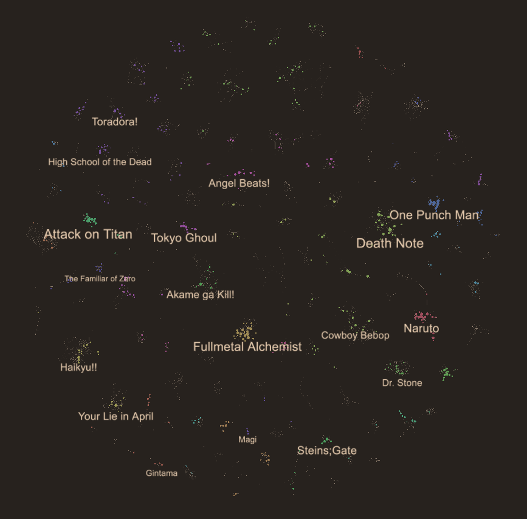

# MAL Map

Cluster and visualize relationships between anime on [MyAnimeList](https://myanimelist.net/).

<!-- Overview image -->

## Description

MAL Map is a web application that visualizes anime relationships on [MyAnimeList](https://myanimelist.net/) and [AniList](https://anilist.co/home). Edges are extracted from the recomendations of users.

#### Clustering

The graph is clustered with multi-level modularity clustering. Some clusters are merged to produce a simpler visualization.

#### Layout

The map layout is generated by a [particle force simulation](https://github.com/d3/d3-force). At first all of the nodes are represented by a single particle. The simulation is then run for a number of iterations. Each iteration all particles are split into new particles, one for each sub-cluster. Appropriate forces are applied between particles to attract related clusters together. This process results in a visually pleasing layout. The layout process can be seen live [here](https://www.malmap.net/#animate=true).

## Contributing

Pull requests are welcome!

### Building

MAL Map is two projects: a backend node app for collecting data and clustering, and a svelte frontend client. The frontend depends on some files in the backend and its outputs.

#### Building the backend

1. Open the `/data-collection` directory and run `npm ci` to install all dependencies.
2. Python3 is used for clustering. Install `networkx` and `cdlib` with `pip install -r requirements.txt`.
3. Run `npm run reset` to build and run the whole data pipeline. This will pull all data from MAL/Anilist and create various txt and json files for the frontend. Use `npm run layout` to skip the data collection step.

#### Building the frontend

1. Open the `/svelte` directory and run `npm ci` to install all dependencies.
2. Run `npm run dev` to start a localhost server with live reloading. http://localhost:8080/#animate=true will show a live view of the layout.

## Acknowledgements

#### Clustering

- https://cdlib.readthedocs.io/en/latest/

#### Layout

- [d3-force](https://github.com/d3/d3-force)
- [d3-force-reuse](https://github.com/twosixlabs/d3-force-reuse)

#### Frontend

- [PIXI.js](https://www.pixijs.com/)
- [PIXI Viewport](https://github.com/davidfig/pixi-viewport)
- [Svelte](https://svelte.dev/)

#### Data

- [MyAnimeList API](https://myanimelist.net/apiconfig/references/api/v2)
- [AniList API](https://anilist.gitbook.io/anilist-apiv2-docs/)
